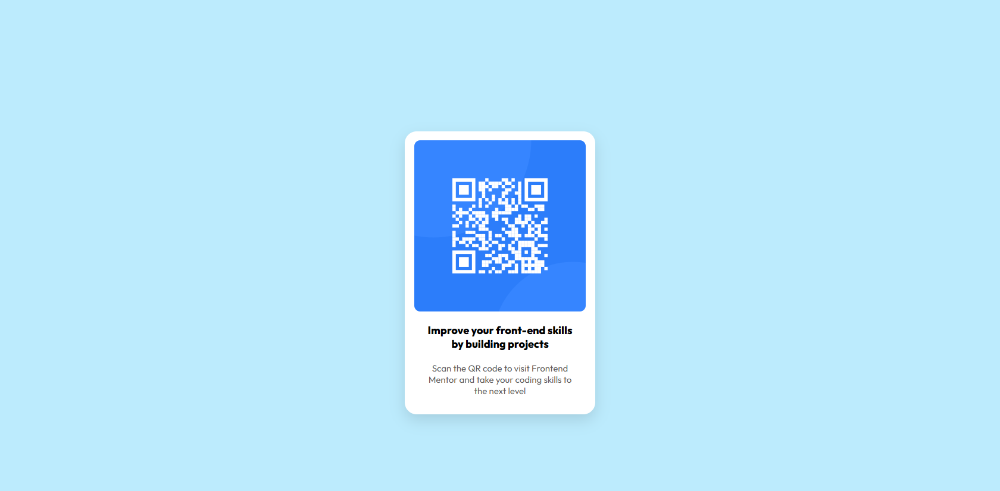

# QR Code Component

A responsive QR Code card built with **HTML5** and **CSS3** as a warm-up project to refresh my frontend development skills.

## 📖 Overview

This project focuses on building a clean and responsive QR code card while practicing the fundamentals of HTML and CSS.

## ✨ Features

- Responsive layout
- Flexbox for alignment
- Mobile-friendly design
- Clean and minimal UI
- Google Fonts integration

## 🛠️ Built With

- HTML5
- CSS3
- Flexbox
- Responsive Design
- Google Fonts (Outfit)

## 📚 What I Learned

- Structuring webpages with semantic HTML
- Creating responsive layouts
- Centering elements using Flexbox
- Using `min()`, `box-shadow`, and `border-radius`
- Writing cleaner and more maintainable CSS

## 🎯 Purpose

This project was built as a warm-up exercise before starting more challenging frontend projects. It helped me refresh my HTML and CSS fundamentals and improve my workflow.

## 📸 Screenshot

## 🔗 Links

- Live Site: [Live Demo](#)
- Solution: [Frontend Mentor Solution](#)

## 🚀 Future Improvements

- Improve accessibility
- Add smoother transitions
- Continue optimizing the code structure

## 👨‍💻 Author

- GitHub: https://github.com/your-username
- Frontend Mentor: https://www.frontendmentor.io/profile/your-username
